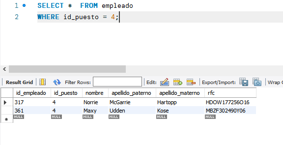
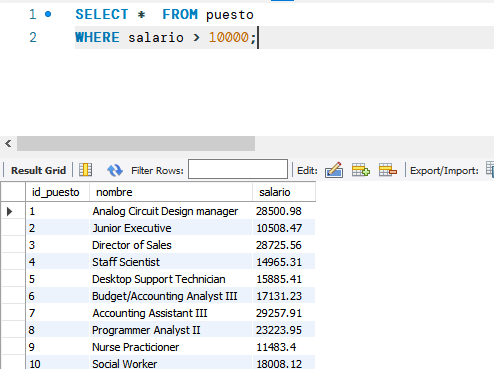
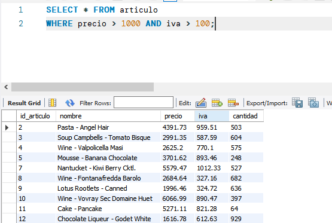
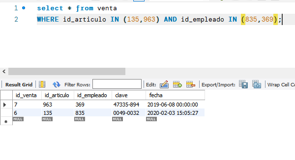
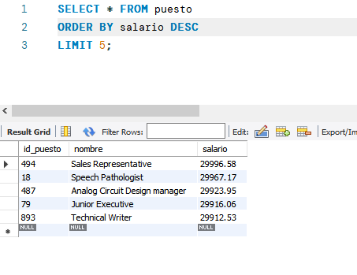

# Sesion 1

## Reto 1

Usando la base de datos tienda, muestra la descripción de las tablas articulo, puesto y venta. Por cada tipo de dato que encuentres llena la siguiente tabla (a mano, puedes dibujarla en un cuaderno o donde tu prefieras. Usa la Documentación de MySQL como referencia si no recuerdas como se usa un comando, o por supuesto, preguntarle al experto.

### Solucion a reto 1

#### articulo

Campo | Tipo | Descripcion
----- | ----- | -----
id_articulo | int | Puede contener numeros enteros
nombre | varchar(45) | Puede contener una cadena de hasta 45 caracteres
precio | double | Puede contener un numero flotante de doble precision
iva | double | Puede contener un numero flotante de doble precision
cantidad | int | Puede contener numeros enteros

#### puesto

Campo | Tipo | Descripcion
----- | ----- | -----
id_puesto | int | Puede contener numeros enteros
nombre | varchar(45) | Puede contener una cadena de hasta 45 caracteres
salario | double | Puede contener un numero flotante de doble precision

#### venta

Campo | Tipo | Descripcion
----- | ----- | -----
id_venta | int | Puede contener numeros enteros
id_articulo | int | Puede contener numeros enteros
id_empleado | int | Puede contener numeros enteros
clave | varchar(45) | Puede contener una cadena de hasta 45 caracteres
fecha | timestamp | Puede contener fechas y fracciones de tiempo

## Reto 2

Usando la tabla `empleados`, escribe consultas que permitan responder las siguientes preguntas.

1. ¿Cuál es el nombre de los empleados con el puesto 4?
2. ¿Qué puestos tienen un salario mayor a $10,000?
3. ¿Qué articulos tienen un precio mayor a $1,000 y un iva mayor a 100?
4. ¿Qué ventas incluyen los artículos 135 o 963 y fueron hechas por los empleados 835 o 369?

### Solucion a reto 2

1. 
2. 
3. 
4. 

## Reto 3

Usando la base de datos `tienda`, escribe una consulta que permita obtener el top 5 de puestos por salarios.

### Solucion a reto 3

