# Sesion 2

## Reto 1

Usando la base de datos `tienda`, escribe consultas que permitan responder las siguientes preguntas.

1. ¿Qué artículos incluyen la palabra `Pasta` en su nombre?
2. ¿Qué artículos incluyen la palabra `Cannelloni` en su nombre?
3. ¿Qué nombres están separados por un guión (`-`) por ejemplo `Puree - Kiwi`?

### Solucion a reto 1

1. 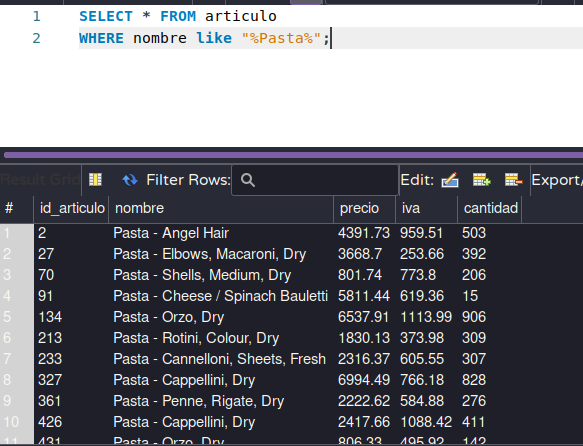
2. 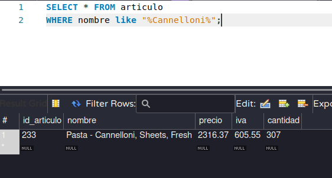
3. 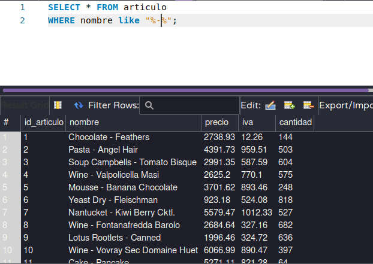

## Reto 2

Usando la base de datos `tienda`, escribe consultas que permitan responder las siguientes preguntas.

1. ¿Cuál es el promedio de salario de los puestos?
2. ¿Cuántos artículos incluyen la palabra `Pasta` en su nombre?
3. ¿Cuál es el salario mínimo y máximo?
4. ¿Cuál es la suma del salario de los últimos cinco puestos agregados?

### Solucion a reto 2

1. 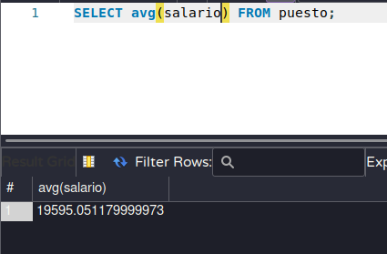
2. 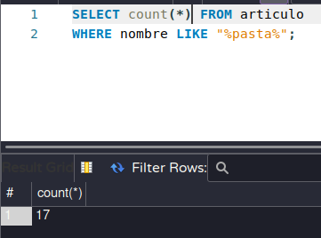
3. 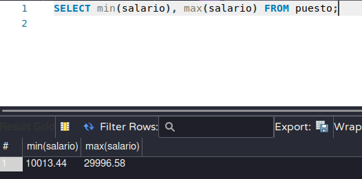
4. 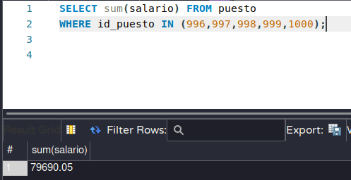

## Reto 3

Usando la base de datos `tienda`, escribe consultas que permitan responder las siguientes preguntas.

1. ¿Cuántos registros hay por cada uno de los puestos?
2. ¿Cuánto dinero se paga en total por puesto?
3. ¿Cuál es el número total de ventas por vendedor?
4. ¿Cuál es el número total de ventas por artículo?

### Solucion a reto 369

1. 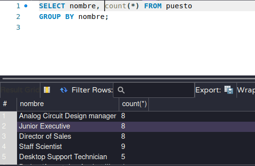
2. 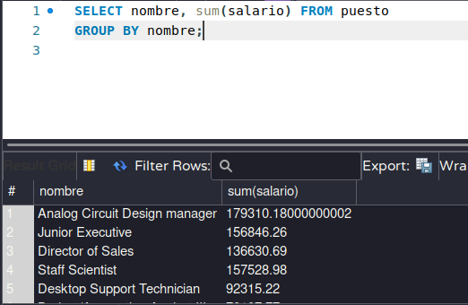
3. 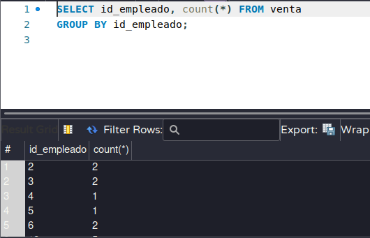
4. 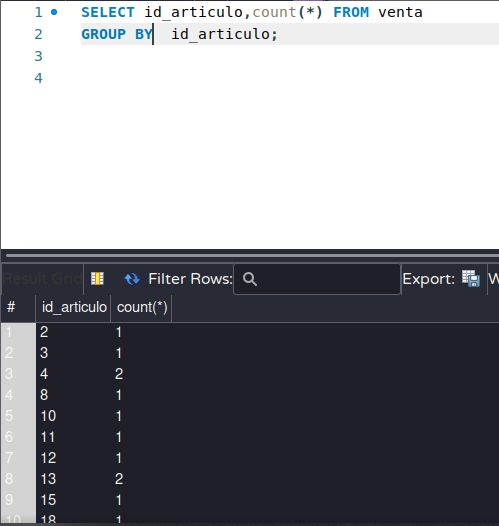

## Reto 4

Usando la base de datos `tienda`, escribe consultas que permitan responder las siguientes preguntas.

1. ¿Cuál es el nombre de los empleados cuyo sueldo es menor a $10,000?
2. ¿Cuál es la cantidad mínima y máxima de ventas de cada empleado?
3. ¿Cuál es el nombre del puesto de cada empleado?

### Solucion a reto 4

1. 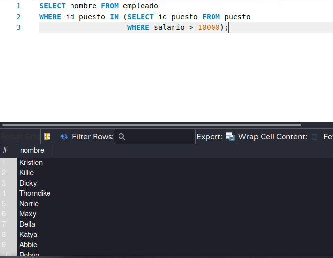
2. 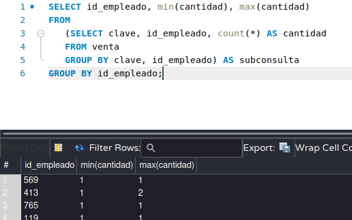
3. 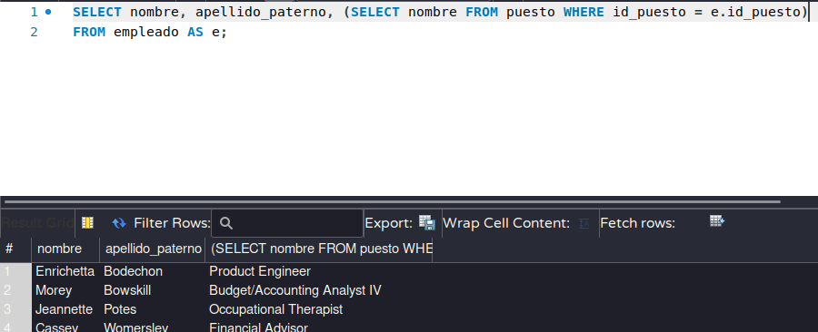

## [Ejercicios sesion 2](./ejercicios-sesion2.sql)