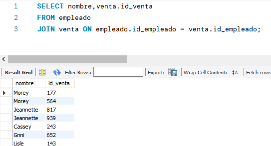

# Sesion 3

## Reto 1

Usando la base de datos `tienda`, escribe consultas que permitan responder las siguientes preguntas.

1. ¿Cuál es el nombre de los empleados que realizaron cada venta?
2. ¿Cuál es el nombre de los artículos que se han vendido?
3. ¿Cuál es el total de cada venta?

### Solucion a reto 1

1. 
2. 
3. 

## Reto 2

Usando la base de datos `tienda`, define las siguientes vistas que permitan obtener la siguiente información.

**AÑADE A TODOS LOS NOMBRES DE TUS VISTAS EL SUFIJO `_<tu identificador>`.** Por ejemplo `mi_vista_hermosa_123`.

1. Obtener el puesto de un empleado.
2. Saber qué artículos ha vendido cada empleado.
3. Saber qué puesto ha tenido más ventas.

### Solucion a reto 2

1. 
2. 
3. 

## [Ejercicios sesion 3](./ejercicios-sesion3.sql)