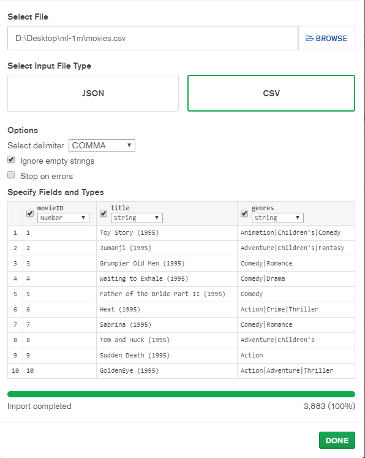

# Sesion 4

## Reto 1

* Definir los campos y tipos de datos para la tabla `movies` haciendo uso de los archivos `movies.dat` y `README`.
* Crear la tabla `movies` (recuerda usar el mismo nombre del archivo sin la extensión para vincular nombres de tablas con archivos).
* Definir los campos y tipos de datos para la tabla `ratings` haciendo uso de los archivos `ratings.dat` y `README`.
* Crear la tabla ratings (recuerda usar el mismo nombre del archivo sin la extensión para vincular nombres de tablas con archivos).

### Solucion a reto 1

## Reto 2

* Usando como base el archivo `movies.dat`, limpiarlo e importar los datos en la tabla `movies` creada en el Reto 1.   

   **Importante:** Este archivo presenta un problema muy común de *encoding*, es decir, la codificación con la que fue definido, no es reconocida por __MySQL__. Para solucionar este problema, elige una codificación diferente al momento de cargar los datos.

* Usando como base el archivo `ratings.dat`, limpiarlo e importar los datos en la tabla `ratings` creada en el Reto 2.   

   **Importante:** Como podrás notar, este archivo tiene demasiados registros, de manera que es normal que la carga sea muy lenta. Esto es algo muy común cuando nos enfrentamos a la carga de archivos. Si ya lleva mucho tiempo y no finaliza, no te preocupes, puedes cancelar la carga.

* Finalmente, añade un registro en cada tabla usando `INSERT INTO`.

### Solucion a reto 2

## Reto 3

* Crear la colección `movies`

* Importar datos a la colección `movies` desde el archivo `movies.csv`

   Para importar documentos, se usa la opción del menú `Collection > Import Data` que abre un diálogo para seleccionar del tipo de archivo CSV y el archivo mismo.

   Validar que cada campo tenga nombre y que estén todos los campos, además valida la cantidad de documentos, que en este caso debería de ser 3883.

* Crear la colección `ratings`

   Seleccionar la colección y continuar.

* Importar datos a la colección `ratings` desde el archivo `ratings.csv`

   Para importar usar la opción del menú `Collection > Import Data` que abre un diálogo para seleccionar del tipo de archivo CSV y el archivo mismo.
   Validar que cada campo tenga nombre y que estén todos los campos, además valida la cantidad de documentos, que en este caso debería de ser 1000209 documentos.

### Solucion a reto 3

## Ejercicios sesion 4

