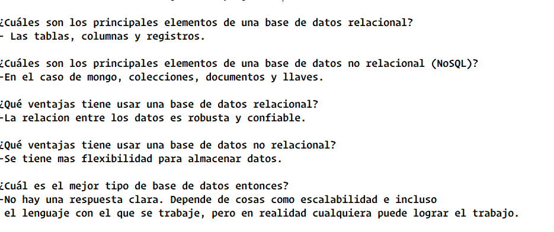
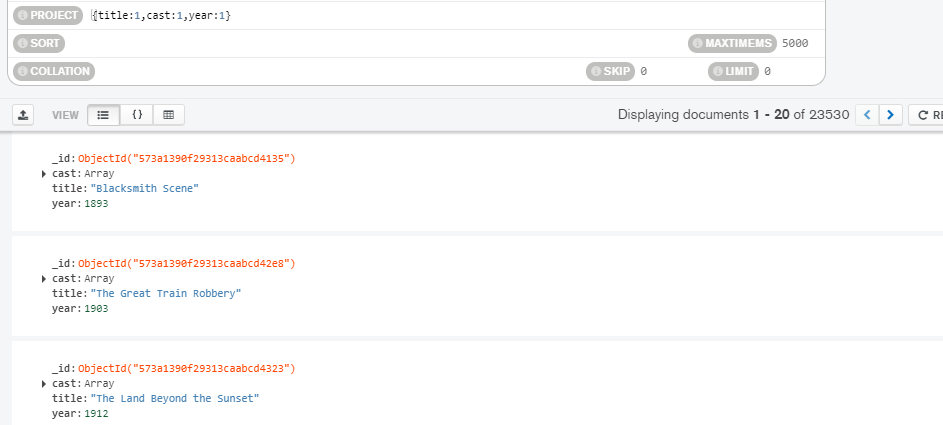
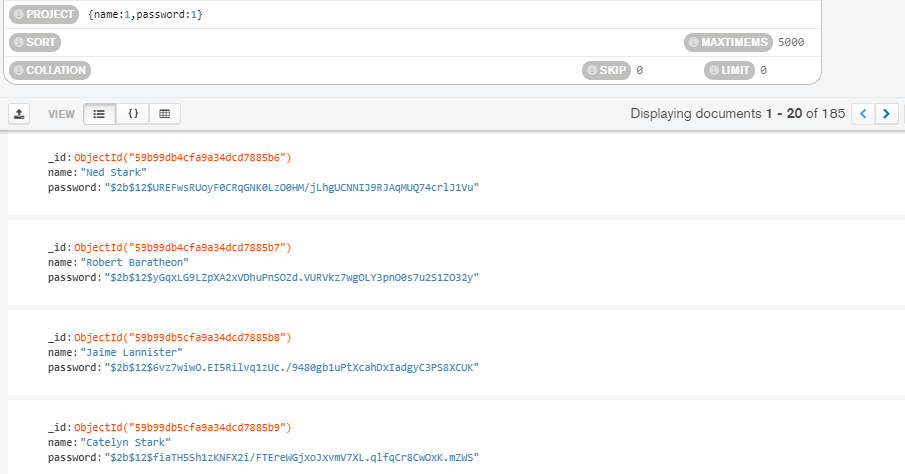
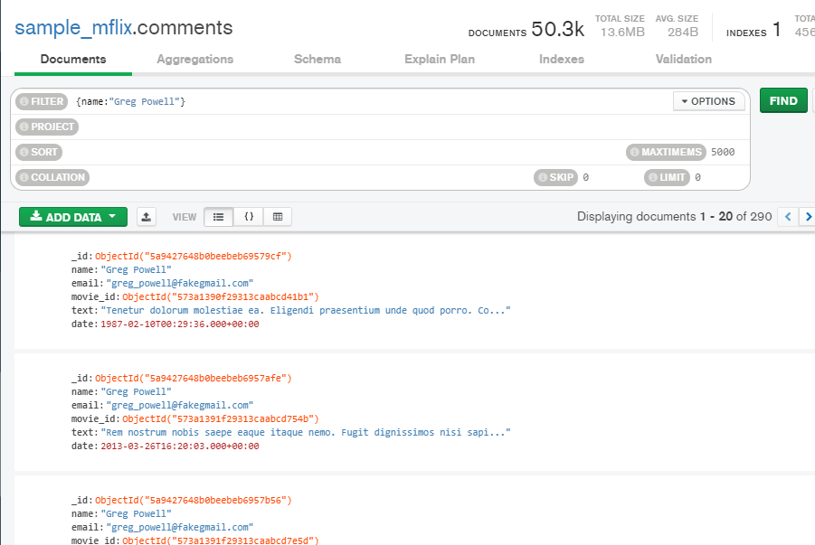
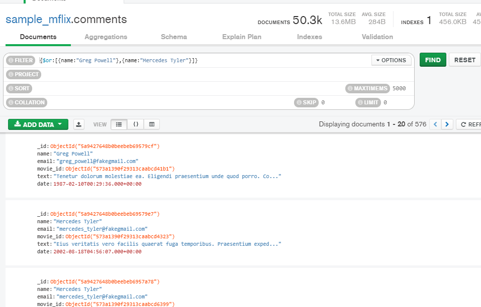
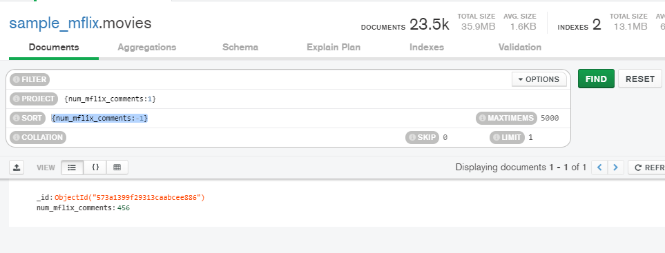
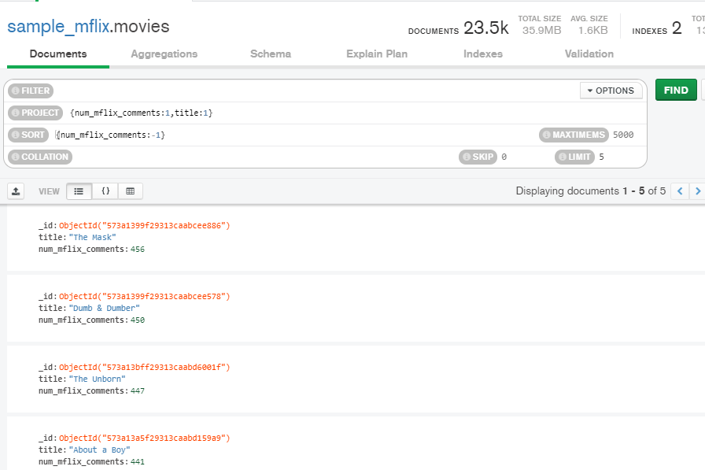

# Sesion 5

## Para comenzar contesta las siguientes preguntas

* ¿Cuáles son los principales elementos de una base de datos relacional?
* ¿Cuáles son los principales elementos de una base de datos no relacional (NoSQL)?
* ¿Qué ventajas tiene usar una base de datos relacional?
* ¿Qué ventajas tiene usar una base de datos no relacional?
* ¿Cuál es el mejor tipo de base de datos entonces?

### Mis respuestas

## Reto 1

Usando la base de datos `sample_mflix`, proyecta los datos que se solicitan.

1. Fecha, nombre y texto de cada comentario.
2. Título, elenco y año de cada película.
3. Nombre y contraseña de cada usuario.

### Solucion a reto 1

1. 
2. 
3. 

## Reto 2

Usando la base de datos `sample_mflix`, agrega proyeccciones, filtros, ordenamientos y límites que permitan contestar las siguientes preguntas.

1. ¿Qué comentarios ha hecho Greg Powell?
2. ¿Qué comentarios han hecho Greg Powell o Mercedes Tyler?
3. ¿Cuál es el máximo número de comentarios en una película?
4. ¿Cuál es título de las cinco películas más comentadas?

### Solucion a reto 2

1. 
2. 
3. 
4. 

## [Ejercicios sesion 5](./ejercicios-sesion5.txt)
