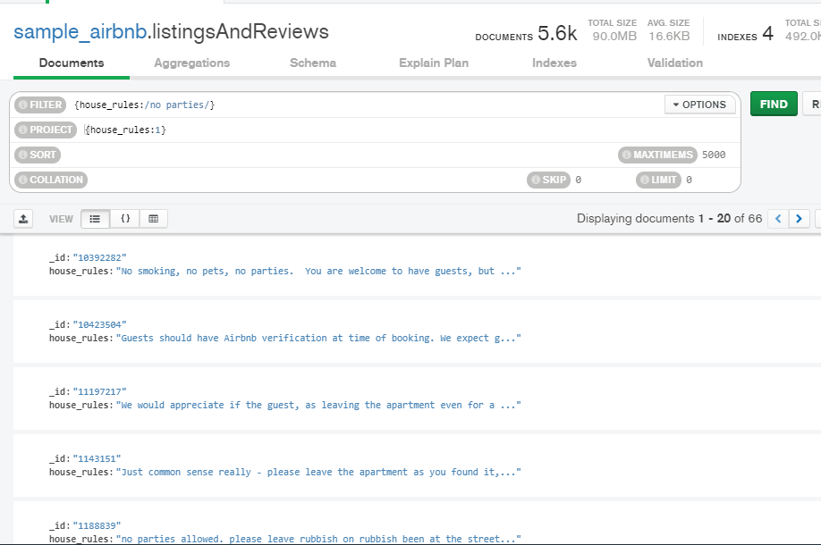
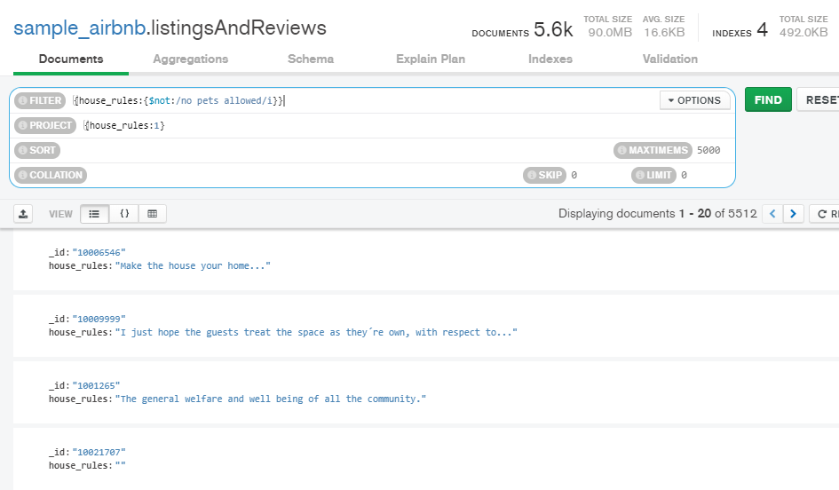
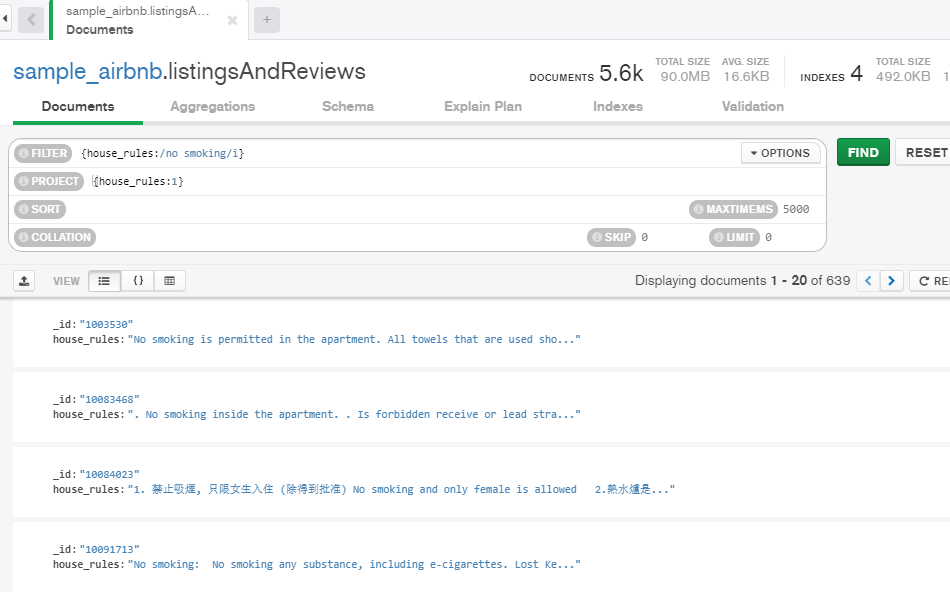
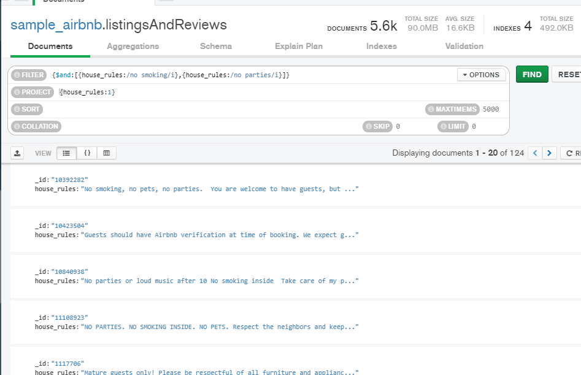
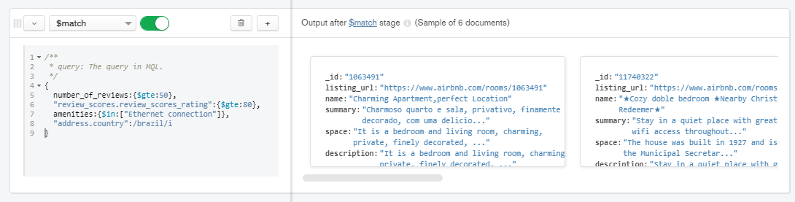
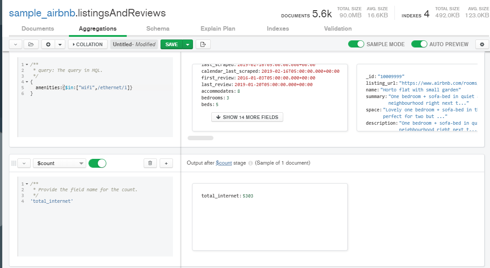
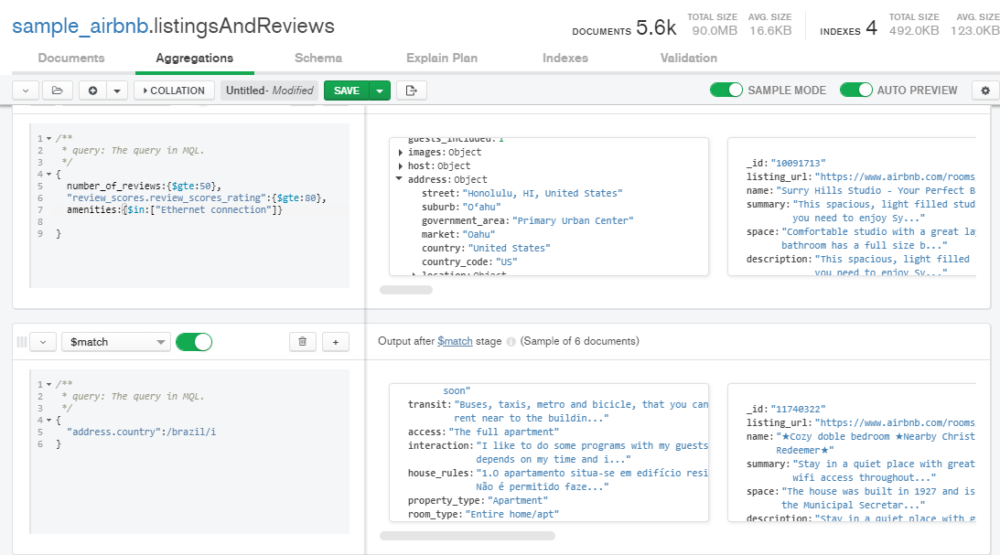

# Sesion 6

## Reto 1

Usando la base de datos `sample_airbnblistingsAndReviews`, realiza los siguientes filtros:

1. Propiedades que no permitan fiestas.
2. Propiedades que admitan mascotas.
3. Propiedades que no permitan fumadores.
4. Propiedades que no permitan fiestas ni fumadores.

### Solucion a reto 1

1. 
2. 
3. 
4. 

## Reto 2

Usando la colección `sample_airbnb.listingsAndReviews`, agrega un filtro que permita obtener todas las publicaciones que tengan 50 o más comentarios, que la valoración sea mayor o igual a 80, que cuenten con conexión a Internet vía cable y estén ubicada en Brazil.

### Solucion a reto 2

## Reto 3

Usando la colección `sample_airbnb.listingsAndReviews`, mediante el uso de agregaciones, encontrar el número de publicaciones que tienen conexión a Internet, sea desde Wifi o desde cable (Ethernet).

### Solucion a reto 3

## Ejercicios sesion 6

Se pueden hacer mas capas, pero pienso que esta funciona bien para esta consulta.

