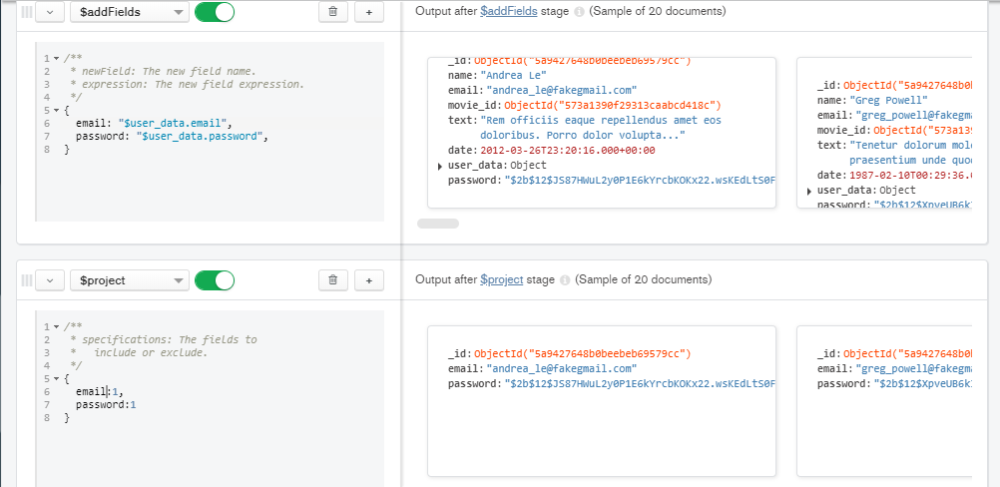

# Sesion 7

## Reto 1

Con base en el ejemplo 1, modifica el agrupamiento para que muestre el costo promedio por habitación por país de las propiedades de tipo casa.

### Solucion a reto 1

## Reto 2

Usando las colecciones `comments` y `users`, se requiere conocer el correo y contraseña de cada persona que realizó un comentario. Construye un pipeline que genere como resultado estos datos.

**NO CIERES ESTE *PIPELINE* PUES LO USAREMOS MÁS ADELANTE**

### Solucion a reto 2

## Reto 3

Usando el *pipeline* que generaste en el Reto 2, genera la vista correspondiente.

### Solucion a reto 3

## Ejercicios sesion 7

